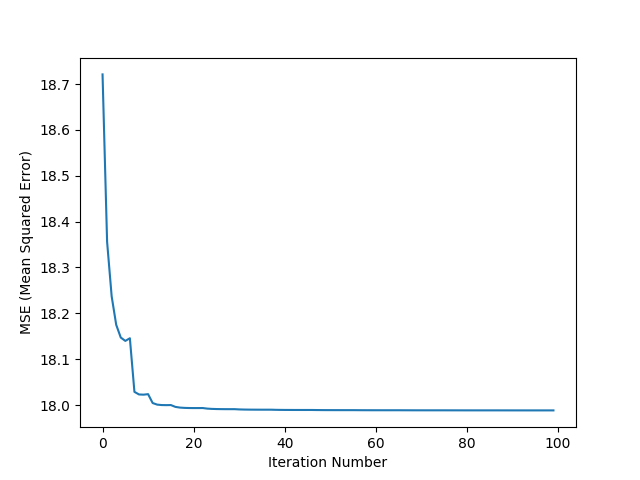
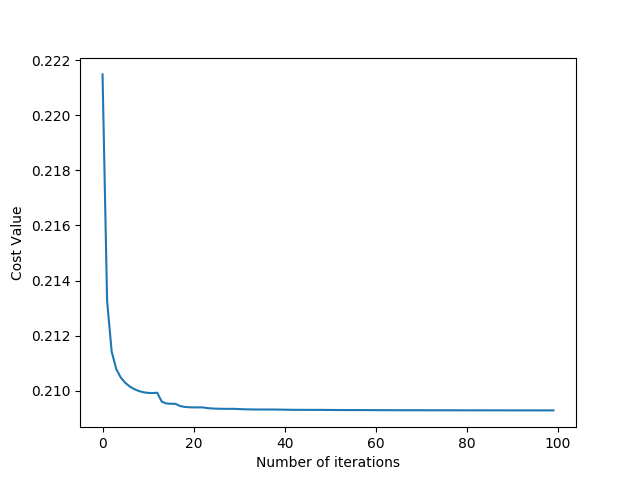
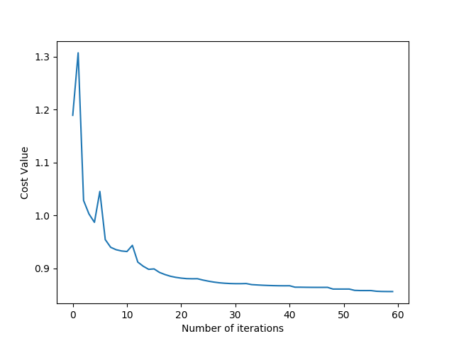

# Machine Learning

### Starter projects to learning about Machine Learning.

## Regressions

These regression examples used a data about different cars such as their fuel efficiency, number of cylinders, horsepower, weight... to train the model and then make predictions on different cars.

## Linear Regression

The Linear Regression predicts the different points of data about a new car based on the data in the `cars.csv` file. e.g. it will be able to predict the horsepower of a car based on the number of cylinders, displacement and weight. The accuracy was 66.853% a graph is also plotted of number of iterations against the MSE (Mean squared error):

##### *The training iterations stopped having a positive effect at around 20-25, I used 100 iterations to make for a nicer plot 

## Logistic Regression

The logistic regression model used the same data set as the linear regression but instead of predicting a continuous value like fuel efficiency or horsepower, it would predict whether the car would pass an emissions test based on the other features. The test uses the horsepower, displacement and weight features. Switiching to a classification problem meant that we changed the cost function from MSE to Cross Entropy and instead of using a basic mx+b equation on its own we passed it into the sigmoid function that has asymptotes at 1 and 0 which makes it perfect for classification problems. The trained logistic regression model got an accuracy of 88%. The graph of cost against iterations:

## Multi-nominal Logistic Regression

This was a better example of a real world solution to a classification problem. This model was used to predict handwritten letters by grayscale pixel values from the MNIST data set. It uses the same cost function as the previous Logistic Regression example but the prediction equation is different as the sigmoid function always gives a marginal probability distribution where the guessed probability of each label doesn't take into account any of the other probabilities, so for this model the softmax equation was used which gives a conditional probability distribution. This model predicted the handwritten letters at an accuracy of 92.4%, I have seen solutions using Convolutional Neural Networks and K Nearest Neighbour algorithms achieve 98% and above. The graph for cost history against iterations for this model: 

## K Nearest Neighbour

The first K Nearest Neighbour was build using lodash functions, the model was used to predict which bucket a ball would fall into in a game of plinko, a group of 1000 test balls, all different sizes and with different bounciness were dropped and the buckets they fell into were recorded. This was the data set that the model was trained on.

The other KNN model was a vectorised version using Tensor flow to predict house prices based on features such as square footage, number of bedrooms, number of floors...

## Future

My next step is to learn about Convolutional Neural Networks to achieve a higher accuracy in with the MNIST data and then to apply one of the regression models to one of my projects.